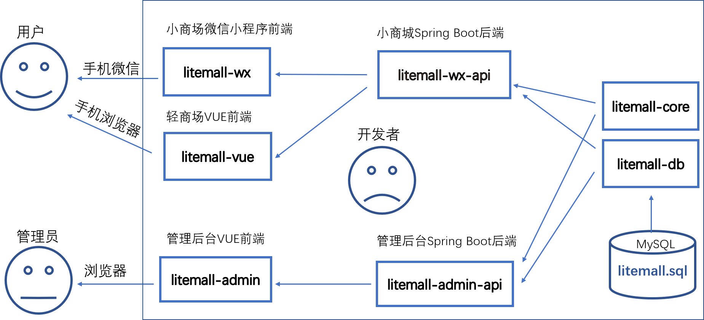
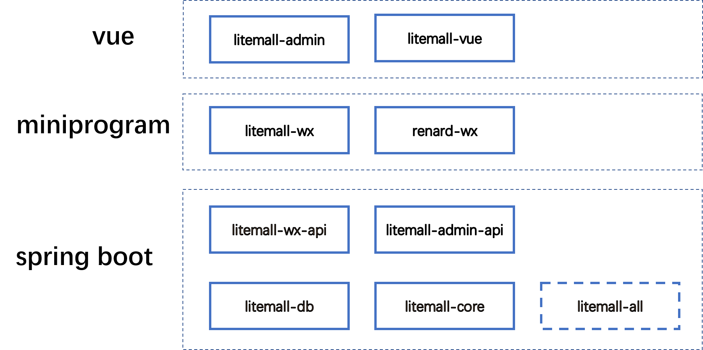

# litemall

又一个小商场系统。

litemall = Spring Boot后端 + Vue管理员前端 + 微信小程序用户前端 + Vue用户移动端


## 项目实例

### 小商场实例

* renard-wx模块实例

    

> 注意：此实例是真实小商场，开发者可以购买商品和付款，但请不要尝试退款操作。

* litemall-wx模块实例

    

> 注意：此实例是测试小商场，开发者请不要尝试购买商品、付款、退款操作。

### 轻商场实例

请手机扫描以下二维码访问:

    

或者浏览器采用手机模式访问以下网址: [http://122.51.199.160:8080/vue/index.html#/](http://122.51.199.160:8080/vue/index.html#/)

注意：
> 1. 由于第一次加载数据量较大，建议wifi网络访问，且耐心等待数秒。
> 2. 此实例是测试轻商场，不支持支付，而且处于开发中还不完善。

### 管理后台实例

    

1. 浏览器打开，输入以下网址: [http://122.51.199.160:8080/#/login](http://122.51.199.160:8080/#/login)
2. 管理员用户名`admin123`，管理员密码`admin123`
> 注意：此实例只是测试管理后台，不是前两个小商城的管理后台。

## 项目架构
    

## 技术栈

> 1. Spring Boot
> 2. Vue
> 3. 微信小程序

    

## 功能

### 小商城功能

* 首页
* 专题列表、专题详情
* 分类列表、分类详情
* 品牌列表、品牌详情
* 新品首发、人气推荐
* 优惠券列表、优惠券选择
* 团购
* 搜索
* 商品详情、商品评价、商品分享
* 购物车
* 下单
* 订单列表、订单详情
* 地址、收藏、足迹、意见反馈
* 客服

### 管理平台功能

* 会员管理
* 商城管理
* 商品管理
* 推广管理
* 系统管理
* 配置管理
* 统计报表

## 快速启动

1. 配置最小开发环境：
    * [MySQL](https://dev.mysql.com/downloads/mysql/)
    * [JDK1.8或以上](http://www.oracle.com/technetwork/java/javase/overview/index.html)
    * [Maven](https://maven.apache.org/download.cgi)
    * [Nodejs](https://nodejs.org/en/download/)
    * [微信开发者工具](https://developers.weixin.qq.com/miniprogram/dev/devtools/download.html)
    
2. 数据库依次导入litemall-db/sql下的数据库文件
    * litemall_schema.sql
    * litemall_table.sql
    * litemall_data.sql

3. 启动小商场和管理后台的后端服务

    打开命令行，输入以下命令
    ```bash
    cd litemall
    mvn install
    mvn clean package
    java -Dfile.encoding=UTF-8 -jar litemall-all/target/litemall-all-0.1.0-exec.jar
    ```
    
4. 启动管理后台前端

    打开命令行，输入以下命令
    ```bash
    npm install -g cnpm --registry=https://registry.npm.taobao.org
    cd litemall/litemall-admin
    cnpm install
    cnpm run dev
    ```
    此时，浏览器打开，输入网址`http://localhost:9527`, 此时进入管理后台登录页面。
    
5. 启动小商城前端
   
   这里存在两套小商场前端litemall-wx和renard-wx，开发者可以分别导入和测试：
   
   1. 微信开发工具导入litemall-wx项目;
   2. 项目配置，启用“不校验合法域名、web-view（业务域名）、TLS 版本以及 HTTPS 证书”
   3. 点击“编译”，即可在微信开发工具预览效果；
   4. 也可以点击“预览”，然后手机扫描登录（但是手机需开启调试功能）。
      
   注意：
   > 这里只是最简启动方式，而小商场的微信登录、微信支付等功能需开发者设置才能运行，

6. 启动轻商城前端

    打开命令行，输入以下命令
    ```bash
    npm install -g cnpm --registry=https://registry.npm.taobao.org
    cd litemall/litemall-vue
    cnpm install
    cnpm run dev
    ```
    此时，浏览器（建议采用chrome 手机模式）打开，输入网址`http://localhost:6255`, 此时进入轻商场。

    注意：
    > 现在功能很不稳定，处在开发阶段。